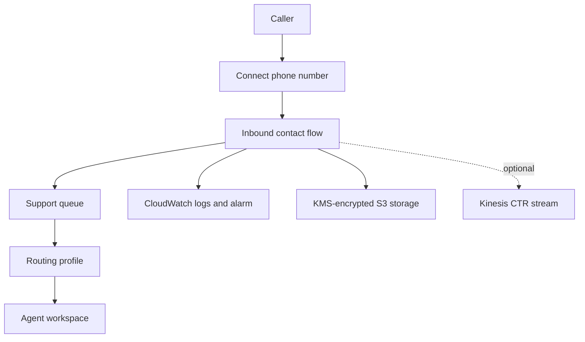

# Amazon Connect Terraform Platform

A complete, portfolio-ready Infrastructure as Code project for deploying an Amazon Connect contact center foundation on AWS. The repository packages the Connect instance, routing objects, encrypted data storage, observability, a working inbound flow, automated tests, and GitHub Actions deployment through AWS OIDC.

## What this deploys

- Amazon Connect instance with flow logging, inbound/outbound calling, and configurable Contact Lens
- Business hours, standard queues, routing profiles, and security profiles
- Two-level user hierarchy and optional SAML or Connect-managed users
- Functional inbound contact flow that greets callers and transfers them to a queue
- Optional DID or toll-free number claim and contact-flow association
- KMS-encrypted S3 storage for call recordings, chat transcripts, and scheduled reports
- Optional Kinesis stream for contact trace records
- CloudWatch log retention, error metric filter, alarm, and operations dashboard
- Terraform native tests using a mocked AWS provider
- Pull-request validation and manual OIDC-based plan/apply/destroy workflows

## Architecture



See [Architecture](docs/architecture.md) for resource relationships and design decisions.

## Repository layout

```text
.
├── .github/workflows/          # Validation and OIDC deployment workflows
├── bootstrap/github-oidc/      # One-time AWS trust and deployment-role setup
├── docs/                       # Architecture and deployment runbooks
├── environments/               # Environment-specific variable files
├── modules/amazon-connect/     # Reusable Amazon Connect platform module
├── tests/                      # Terraform native tests
├── main.tf                     # Root module invocation
├── variables.tf                # Public input contract
└── outputs.tf                  # Instance, queue, flow, and storage outputs
```

## Prerequisites

- Terraform 1.7 or later
- AWS provider credentials with permission to create Amazon Connect and supporting resources
- An AWS Region where Amazon Connect is available
- A globally unique Connect instance alias
- GitHub Actions environment and AWS OIDC role for workflow-based deployments

The AWS principal performing the first deployment also needs permission to create or update the Amazon Connect service-linked role.

## Quick start

1. Clone the repository and change the placeholder alias in `environments/dev.tfvars`.

2. Initialize and validate:

   ```bash
   terraform init
   terraform fmt -check -recursive
   terraform validate
   terraform test
   ```

3. Review the deployment plan:

   ```bash
   terraform plan \
     -var-file=environments/dev.tfvars \
     -out=tfplan
   ```

4. Apply the reviewed plan:

   ```bash
   terraform apply tfplan
   ```

5. Open the returned `access_url` and complete any external SAML identity-provider configuration required by your organization.

For remote state and GitHub Actions setup, use the [Deployment runbook](docs/deployment.md).

## Safe defaults

- Phone-number claiming is disabled to avoid unplanned number charges.
- Contact Lens is disabled in `dev` until its pricing and regional availability are reviewed.
- The data bucket blocks public access, requires TLS, uses KMS encryption, and does not allow force deletion.
- GitHub Actions uses short-lived OIDC credentials instead of stored AWS access keys.
- The workflow performs deployment only through a manually selected action and GitHub environment.
- Connect users are empty by default. Passwords must never be committed to the repository.

## Optional users

SAML is the default identity-management type. A non-sensitive SAML user example can be supplied in a private variable file:

```hcl
users = {
  agent01 = {
    first_name            = "Example"
    last_name             = "Agent"
    routing_profile_key   = "frontline"
    security_profile_keys = ["agent"]
    team_key              = "general-support"
  }
}
```

For `CONNECT_MANAGED`, each user also requires a password. Supply those values with a non-committed `.tfvars` file, an encrypted pipeline secret, or `TF_VAR_users`. Passwords are stored in Terraform state, so the backend must be encrypted and tightly access-controlled.

## Phone number and live-call setup

Set the following only after reviewing number availability and charges:

```hcl
claim_phone_number = true
phone_country_code = "US"
phone_number_type  = "DID"
phone_number_prefix = "+1760"
```

Terraform then claims an available number and associates it with the sample inbound flow. Availability is not guaranteed for a requested prefix.

## Validation

```bash
make fmt-check
make validate
make test
make lint
```

The test suite plans the complete configuration with mocked AWS data, checks expected queues and routing profiles, exercises optional features, and rejects invalid instance aliases without requiring AWS credentials.

## Cost and cleanup

Amazon Connect is usage-based, while claimed phone numbers, Kinesis streams, KMS keys, CloudWatch data, and S3 storage can incur charges even in a low-traffic environment. Review the AWS pricing pages before applying.

To remove a development deployment:

```bash
terraform destroy -var-file=environments/dev.tfvars
```

The S3 bucket uses `force_destroy = false`. Empty the bucket and its object versions intentionally before destroying, or explicitly enable force deletion only in a disposable environment.

## References

- [Amazon Connect administrator guide](https://docs.aws.amazon.com/connect/latest/adminguide/what-is-amazon-connect.html)
- [Amazon Connect flow language](https://docs.aws.amazon.com/connect/latest/adminguide/flow-language.html)
- [AWS provider Connect resources](https://registry.terraform.io/providers/hashicorp/aws/latest/docs/resources/connect_instance)
- [GitHub Actions OIDC in AWS](https://docs.github.com/actions/deployment/security-hardening-your-deployments/configuring-openid-connect-in-amazon-web-services)

## License

Licensed under the [MIT License](LICENSE).

<!-- BEGIN_TF_DOCS -->
<!-- Run terraform-docs markdown table . to refresh the generated inputs and outputs section. -->
<!-- END_TF_DOCS -->
