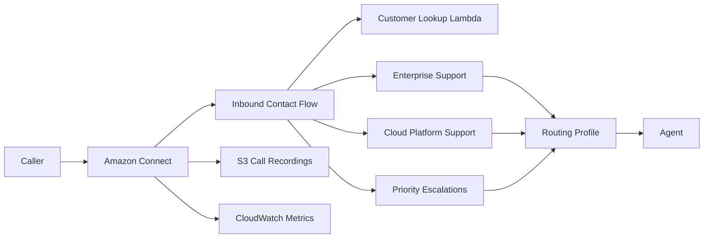

#sspedale 1/16/2023- Opentext/Webroot

Terraform reference implementation for an Amazon Connect contact-center foundation with reusable modules, environment separation, Lambda integration, contact-flow-as-code, S3 call-recording storage, CloudWatch monitoring, and GitHub Actions validation.

## Architecture



## What this repository manages

- Amazon Connect instance with inbound and outbound calling enabled
- Business hours for weekday support coverage
- Enterprise Support, Cloud Platform Support, and Priority Escalations queues
- Voice routing profile with queue priorities
- Lambda association for customer lookup and contact enrichment
- Amazon Connect contact flow stored as a version-controlled Terraform template
- S3 storage configuration for call recordings
- CloudWatch missed-call alarm
- Separate `dev` and `prod` Terraform roots using shared modules
- GitHub Actions checks for Terraform formatting, initialization, and validation

## Repository layout

```text
.
├── .github/workflows/terraform.yml
├── contact-flows/
│   └── inbound-support.json.tftpl
├── docs/
│   ├── architecture.md
│   └── runbook.md
├── envs/
│   ├── dev/
│   └── prod/
├── lambda/
│   ├── customer-lookup/
│   └── metrics-enricher/
├── modules/
│   ├── connect/
│   ├── lambda/
│   └── observability/
├── scripts/validate.sh
└── Makefile
```

## Contact flow

The inbound flow enables flow logging and call recording, plays a welcome prompt, invokes the customer-lookup Lambda, presents a three-option support menu, sets the target queue, and transfers the contact. Queue IDs and the Lambda ARN are injected into the JSON template by Terraform so the same flow definition can be promoted across environments.

## Terraform structure

`envs/dev` and `envs/prod` compose the same reusable modules with environment-specific naming and tags. The Connect module owns the instance, business hours, queues, routing profile, Lambda association, recording configuration, and inbound contact flow. The Lambda module packages and deploys the customer-lookup function. The observability module provides supporting storage and a CloudWatch missed-call alarm.

## Validation

Terraform 1.7 or later is required.

```bash
make fmt
make validate
```

Or validate an environment directly:

```bash
terraform -chdir=envs/dev init -backend=false
terraform -chdir=envs/dev validate
```

GitHub Actions performs `terraform fmt -recursive -check`, `terraform init -backend=false`, and `terraform validate` against both `dev` and `prod` on pushes and pull requests.

## Planning

With AWS credentials configured:

```bash
make plan-dev
make plan-prod
```

A production deployment should use remote Terraform state, controlled IAM roles, change review, and an approved CI/CD deployment path rather than local state.

## Operational considerations

Production implementations should define retention and encryption requirements for recordings, protect customer data in contact attributes and logs, use least-privilege IAM, monitor Lambda latency and errors, track queue and missed-call metrics, and test contact-flow failure branches before promotion.

See [Architecture](docs/architecture.md) and the [Operations Runbook](docs/runbook.md) for additional details.

## References

- [Amazon Connect Administrator Guide](https://docs.aws.amazon.com/connect/latest/adminguide/what-is-amazon-connect.html)
- [Amazon Connect Flow Language](https://docs.aws.amazon.com/connect/latest/adminguide/flow-language.html)
- [Terraform AWS Provider - Amazon Connect](https://registry.terraform.io/providers/hashicorp/aws/latest/docs/resources/connect_instance)

## License

MIT License. See [LICENSE](LICENSE).
